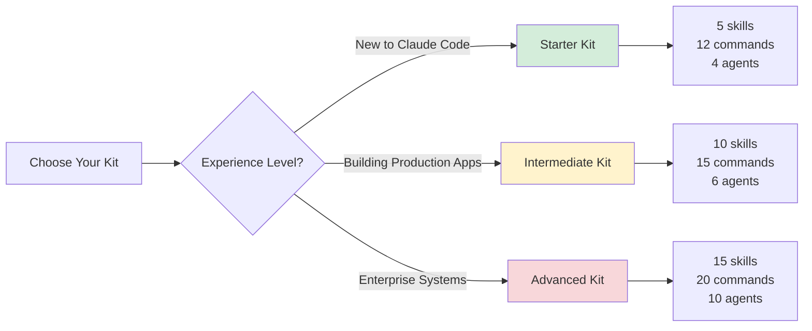
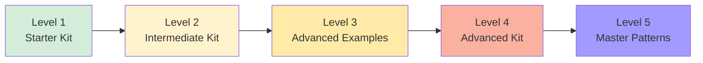

# Claudius Skills

> Production-ready Claude Code extensibility configurations for developers at every level

<div align="center">

[]()
[]()
[]()
[]()
[]()
[]()
[]()

[Quick Start](#-quick-start) • [Choose Your Kit](#-choose-your-kit) • [Documentation](docs/) • [Examples](examples/)

</div>

---

## 📖 What is Claudius Skills?

A comprehensive, production-ready collection of **Claude Code extensibility configurations** covering all five pillars:

| Pillar | What It Does | Count |
|--------|-------------|-------|
| **Skills** | Automatically activate based on context | 57 |
| **Slash Commands** | Manual shortcuts (`/command`) | 80+ |
| **Hooks** | Event-driven automation | 36 |
| **Agents** | Specialized AI consultants | 46 |
| **MCP Servers** | External service integrations | 20+ |

---

## 🚀 Quick Start

### 1. Clone the Repository

```bash
git clone https://github.com/Dexploarer/claudius-skills.git
cd claudius-skills
```

### 2. Choose Your Kit

Pick the kit that matches your experience level:



### 3. Copy to Your Project

```bash
# For beginners
cp -r starter-kit/.claude /path/to/your/project/

# For production apps
cp -r intermediate-kit/.claude /path/to/your/project/

# For enterprise
cp -r advanced-kit/.claude /path/to/your/project/
```

### 4. Start Using

```bash
cd /path/to/your/project
claude
```

That's it! Skills activate automatically, commands are available with `/command-name`.

**→ [Complete Quick Start Guide](docs/getting-started/README.md)**

---

## 🎯 Choose Your Kit

### 🟢 Starter Kit
**Best for:** Learning Claude Code, simple projects

**What you get:**
- 5 essential skills (README generation, code explanation, bug finding, testing, git helper)
- 12 core commands (`/explain`, `/test`, `/commit`, `/review`, `/refactor`, etc.)
- 4 generalist agents (code reviewer, test writer, doc writer, debugger)

```bash
cp -r starter-kit/.claude /your/project/
```

**→ [Starter Kit Details](starter-kit/)**

---

### 🟡 Intermediate Kit
**Best for:** Production applications, modern frameworks

**What you get:**
- 10 framework skills (React, Vue, Next.js, Django, FastAPI, Express, GraphQL, etc.)
- 15 production commands (`/deploy`, `/docker-build`, `/api-docs-generate`, etc.)
- 6 specialist agents (API designer, database architect, DevOps engineer, etc.)

```bash
cp -r intermediate-kit/.claude /your/project/
```

**→ [Intermediate Kit Details](intermediate-kit/)**

---

### 🔴 Advanced Kit
**Best for:** Enterprise systems, compliance, observability

**What you get:**
- 15 enterprise skills (microservices, compliance automation, distributed tracing, etc.)
- 20 advanced commands (`/canary-deploy`, `/compliance-scan`, `/incident-declare`, etc.)
- 10 enterprise consultants (architects, SRE, compliance officer, security architect)

```bash
cp -r advanced-kit/.claude /your/project/
```

**→ [Advanced Kit Details](advanced-kit/)**

---

## 🎨 Specialized Kits

### 💼 Productivity Skills
**For:** Personal and team productivity workflows

- 6 productivity skills (brainstorming, email composition, meeting notes, reports)
- 13 commands (`/agenda`, `/email`, `/minutes`, `/summarize`, etc.)
- 4 productivity agents (content writer, creative consultant, productivity coach)

```bash
cp -r productivity-skills/starter-kit/.claude /your/project/
```

---

### 🏆 Competitive AI Frameworks
**For:** AI-powered code competitions

- 3 competition skills (bug hunting, code quality analysis, user flow testing)
- 3 competition commands (`/run-bug-hunt`, `/run-flow-test`, `/run-quality-check`)
- 12 team-based agents (3 teams with coordinator, tester, reviewer, documenter)

```bash
cp -r competitive-ai-frameworks/.claude /your/project/
```

---

### 🤖 Eliza OS Kit
**For:** Building AI agents with ElizaOS framework

- 6 ElizaOS skills (character generation, deployment, knowledge base, memory, plugins)
- 8 commands (`/dev-agent`, `/build-plugin`, `/deploy-agent`, etc.)
- 6 specialist agents (character designer, deployment engineer, memory architect, etc.)

```bash
cp -r eliza-os-kit/.claude /your/project/
```

**→ [ElizaOS Kit Documentation](eliza-os-kit/.claude/rules/CLAUDE.md)**

---

## 📊 Learning Path

Progress from beginner to master:



| Level | Kit | Focus | When to Use |
|-------|-----|-------|-------------|
| **1** | Starter Kit | Learning fundamentals | New to Claude Code, simple projects |
| **2** | Intermediate Kit | Production workflows | Building real apps with frameworks |
| **3** | Examples/Advanced | Complex integrations | Security, performance, optimization |
| **4** | Advanced Kit | Enterprise systems | Microservices, compliance, observability |
| **5** | Examples/Master | Master patterns | Distributed systems, custom frameworks |

**→ [Detailed Learning Paths](docs/getting-started/README.md#learning-paths)**

---

## 🎁 What's Included

### 📚 Core Kits (Progressive Learning)
- **Starter Kit** - 5 skills, 12 commands, 4 agents
- **Intermediate Kit** - 10 skills, 15 commands, 6 agents
- **Advanced Kit** - 15 skills, 20 commands, 10 agents

### 🎯 Specialized Kits
- **Productivity Skills** - Personal and team productivity (2 levels)
- **Competitive AI Frameworks** - AI competitions and team challenges
- **Eliza OS Kit** - ElizaOS agent development

### 🛠️ Additional Resources
- **25 Niche Skills** - Performance, security, testing, DevOps, i18n, mobile, data science
- **10 Emerging Tech Skills** - AI/ML, edge computing, WebAssembly, quantum, GraphQL federation
- **36 Production Hooks** - Development safety, deployment, code quality, security, performance
- **17 Framework Rules** - React, Vue, Next.js, Django, Angular, Astro, SvelteKit, Remix, and more
- **10 Modern Commands** - AI/ML workflows, edge deployment, observability, platform engineering
- **4 Specialized Agents** - Edge computing, MLOps, platform architecture, WebAssembly

**→ [Complete Feature List](docs/reference/skills-catalog.md)**

---

## 📁 Repository Structure

```
claudius-skills/
├── .github/                     # Issue templates, PR templates, labels
├── docs/                        # Complete documentation
│   ├── getting-started/        # Quick start guides
│   ├── guides/                 # Best practices, implementation
│   ├── reference/              # Skills catalog, master index
│   └── architecture/           # Project structure, milestones
├── starter-kit/                # Level 1: Beginner (5 skills)
├── intermediate-kit/           # Level 2: Production (10 skills)
├── advanced-kit/               # Level 4: Enterprise (15 skills)
├── productivity-skills/        # Productivity workflows (6 skills)
├── competitive-ai-frameworks/  # AI competitions (3 skills, 12 agents)
├── eliza-os-kit/              # ElizaOS integration (6 skills)
├── examples/                   # Multi-level examples
│   ├── beginner/              # Level 1 examples
│   ├── intermediate/          # Level 2 + niche skills (25)
│   ├── advanced/              # Level 3 + emerging tech (10)
│   └── master/                # Level 5 master patterns
├── hooks-collection/          # 36 production hooks
├── framework-rules/           # 17 framework integrations
├── modern-commands/           # 10 modern workflow commands
├── specialized-agents/        # 4 specialized consultants
├── templates/                 # Create custom skills/commands/agents
└── resources/                 # Additional guides and tutorials
```

**→ [Detailed Structure Guide](docs/architecture/project-structure.md)**

---

## 🛡️ Built-in Safety Features

### Knowledge Cutoff Awareness
AI models have knowledge cutoff dates. This project includes automatic verification:

- ✅ Package version verification before installation
- ✅ API endpoint compatibility checking
- ✅ Framework feature validation
- ✅ Type definition verification
- ✅ Breaking change detection

**Golden Rule:** "When in doubt, verify. Never assume knowledge is current."

### Strict Type Checking
Enforces TypeScript strict mode and class-based architecture:

- ✅ No `any` type allowed
- ✅ Explicit return types required
- ✅ Classes over interfaces for data structures
- ✅ Proper encapsulation and validation
- ✅ Runtime type safety

### Security Hooks
Automatic protection against common mistakes:

- ✅ Secret detection (API keys, tokens, passwords)
- ✅ .env file protection
- ✅ Force push prevention on protected branches
- ✅ Destructive operation confirmations
- ✅ Dependency vulnerability scanning

**→ [Complete Safety Documentation](docs/guides/best-practices.md#safety-features)**

---

## 📚 Documentation

### Quick Access

| Document | Description |
|----------|-------------|
| [Quick Start Guide](docs/getting-started/README.md) | Get up and running in 10 minutes |
| [Best Practices](docs/guides/best-practices.md) | Advanced techniques and recommendations |
| [Skills Catalog](docs/reference/skills-catalog.md) | All 57 skills with descriptions |
| [Master Index](docs/reference/master-index.md) | Complete component catalog |
| [Project Structure](docs/architecture/project-structure.md) | Repository organization |
| [Milestones](docs/architecture/milestones.md) | Project history and achievements |
| [CONTRIBUTING.md](CONTRIBUTING.md) | How to contribute |
| [CHANGELOG.md](CHANGELOG.md) | Version history |

**→ [Complete Documentation Index](docs/)**

---

## 🎯 Use Cases

### Individual Developers
- ✅ Learn Claude Code faster (2-3x acceleration)
- ✅ Save 10-15 hours per week on setup and debugging
- ✅ Prevent 5-10 errors per week automatically
- ✅ Access production-ready patterns instantly

### Development Teams
- ✅ Standardize practices across the organization
- ✅ Reduce onboarding time by 60%
- ✅ Prevent 10-15 incidents per month
- ✅ Save 100-200 developer hours per week

### Enterprises
- ✅ Enforce compliance automatically (SOC2, HIPAA, GDPR, PCI-DSS)
- ✅ Platform engineering and golden paths
- ✅ Save 500+ developer hours per week
- ✅ Cost savings of $100,000+ per month

**→ [Case Studies and Success Stories](docs/getting-started/README.md#success-stories)**

---

## 🔗 External Resources

### Official Documentation
- [Claude Code Documentation](https://docs.claude.com/en/docs/claude-code/)
- [Skills Guide](https://docs.claude.com/en/docs/claude-code/skills)
- [Hooks Reference](https://docs.claude.com/en/docs/claude-code/hooks)
- [Model Context Protocol](https://modelcontextprotocol.io/)

### Community
- [GitHub Discussions](https://github.com/Dexploarer/claudius-skills/discussions) - Ask questions, share ideas
- [Issue Tracker](https://github.com/Dexploarer/claudius-skills/issues) - Report bugs, request features
- [Contributing Guide](CONTRIBUTING.md) - How to contribute

---

## 🙏 Contributing

This is a personal collection, but contributions are welcome!

**Ways to contribute:**
- 🐛 Report bugs or issues
- 💡 Suggest new features
- 📚 Improve documentation
- ✨ Submit new skills, commands, or hooks
- 🎨 Share examples and use cases

**→ [Read the Contributing Guide](CONTRIBUTING.md)**

---

## 📊 Project Statistics

| Metric | Count |
|--------|-------|
| **Total Configurations** | 174+ |
| **Lines of Documentation** | 100,000+ |
| **Code Examples** | 500+ |
| **Technologies Covered** | 25+ |
| **Framework Integrations** | 17 |
| **Completion Status** | 100% ✅ |

---

## 📜 License

MIT License - Free for commercial and personal use. See [LICENSE](LICENSE) for details.

---

## 🎉 Get Started Now

1. **Clone:** `git clone https://github.com/Dexploarer/claudius-skills.git`
2. **Choose:** Pick your kit (Starter, Intermediate, or Advanced)
3. **Copy:** `cp -r [kit]/.claude /your/project/`
4. **Use:** Start with Claude Code and enjoy!

**→ [Complete Quick Start Guide](docs/getting-started/README.md)**

---

<div align="center">

**Built with Claude Code** • **100% Complete** • **Production Ready**

[Documentation](docs/) • [Issues](https://github.com/Dexploarer/claudius-skills/issues) • [Discussions](https://github.com/Dexploarer/claudius-skills/discussions)

*Last Updated: November 3, 2025* • *v1.0.0*

</div>
