# Claudius Skills

> A comprehensive collection of Claude Code configurations covering all five pillars of extensibility

<div align="center">

[]()
[]()
[]()
[]()
[]()
[]()
[]()

[Quick Start](#-quick-start) • [Learning Paths](#-learning-paths) • [What's Inside](#-whats-inside) • [Examples](#-examples)

</div>

---

## 📖 What This Is

A complete, production-ready collection of **Claude Code extensibility configurations** covering all five pillars:

| Pillar | What It Does | Count |
|--------|-------------|-------|
| **Skills** | Automatically activate based on context | 57 total |
| **Slash Commands** | Manual shortcuts you invoke with `/command` | 80+ total |
| **Hooks** | Event-driven automation (git, file operations, etc.) | 36 total |
| **Agents** | Specialized AI consultants with focused expertise | 46 total |
| **MCP Servers** | External service integrations | 20+ supported |

---

## 🗺️ Learning Paths Overview


---

## 🎯 Progressive Learning Path

```mermaid
graph LR
    Level1[Level 1: Beginner<br/>Starter Kit<br/>📚 Learning Focus] --> Level2[Level 2: Intermediate<br/>Intermediate Kit<br/>🏗️ Production Apps]

    Level2 --> Level3[Level 3: Advanced<br/>Examples/Advanced<br/>🔧 Complex Integrations]

    Level3 --> Level4[Level 4: Enterprise<br/>Advanced Kit<br/>🏢 Enterprise Systems]

    Level4 --> Level5[Level 5: Master<br/>Examples/Master<br/>🎓 Master Patterns]

    style Level1 fill:#d4edda
    style Level2 fill:#fff3cd
    style Level3 fill:#ffeaa7
    style Level4 fill:#fab1a0
    style Level5 fill:#a29bfe
```



### Detailed Level Breakdown

| Level | Kit | Focus | When to Use |
|-------|-----|-------|-------------|
| **1: Beginner** | `starter-kit/` | Learning fundamentals | New to Claude Code, simple projects |
| **2: Intermediate** | `intermediate-kit/` | Production workflows | Building real applications with frameworks |
| **3: Advanced** | `examples/advanced/` | Complex integrations | Security compliance, performance optimization |
| **4: Enterprise** | `advanced-kit/` | Enterprise systems | Microservices, compliance, observability |
| **5: Master** | `examples/master/` | Master patterns | Distributed systems, custom frameworks |

---

## 🔀 Specialized Learning Paths


---

## 🚀 Quick Start

### Step 1: Clone Repository

```bash
git clone https://github.com/Dexploarer/claudius-skills.git
cd claudius-skills
```

### Step 2: Choose Your Path


### Step 3: Start Using Claude Code

```bash
cd /path/to/your/project
claude
```

**Skills** activate automatically. **Commands** are available with `/command-name`. **Agents** assist when needed.

---

## 📦 What's Inside

### Core Development Kits

#### 🟢 Starter Kit (Level 1)
**Location:** `starter-kit/.claude/`
**Best for:** Learning Claude Code fundamentals

**Contents:**
- **5 Core Skills**
  - `readme-generator` - Professional README creation
  - `code-explainer` - Beginner-friendly code explanations
  - `bug-finder` - Common bug identification
  - `test-helper` - Comprehensive test writing
  - `git-helper` - Git operation assistance

- **12 Essential Commands**
  - `/explain`, `/test`, `/commit`, `/review`, `/refactor`
  - `/docs`, `/debug`, `/quickfix`, `/setup`
  - `/todo`, `/clean`, `/deps`

- **4 Generalist Agents**
  - `code-reviewer` - Comprehensive code review
  - `test-writer` - Test generation expert
  - `doc-writer` - Documentation specialist
  - `debug-helper` - Debugging assistance

**Quick Start:**
```bash
cp -r starter-kit/.claude /path/to/your/project/
```

---

#### 🟡 Intermediate Kit (Level 2)
**Location:** `intermediate-kit/.claude/`
**Best for:** Production applications with modern frameworks

**Contents:**
- **10 Framework Skills**
  - React, Vue, Next.js components
  - Django models, FastAPI endpoints, Express APIs
  - GraphQL schemas, OpenAPI documentation
  - Database migrations, testing frameworks

- **15 Production Commands**
  - `/api-docs-generate`, `/bundle-analyze`, `/changelog-update`
  - `/coverage-report`, `/db-backup`, `/deploy`
  - `/dependency-update`, `/docker-build`, `/env-setup`
  - `/health-check`, `/migration-create`, `/performance-profile`
  - `/pr-creator`, `/security-audit`, `/version-bump`

- **6 Specialist Agents**
  - `api-designer`, `database-architect`, `devops-engineer`
  - `performance-optimizer`, `security-auditor`, `system-architect`

**Quick Start:**
```bash
cp -r intermediate-kit/.claude /path/to/your/project/
```

---

#### 🔴 Advanced Kit (Level 4)
**Location:** `advanced-kit/.claude/`
**Best for:** Enterprise distributed systems and compliance

**Contents:**
- **15 Enterprise Skills**
  - **Architecture:** Microservices orchestration, API gateway configuration, event-driven architecture, service mesh integration
  - **Compliance:** SOC2/HIPAA/GDPR/PCI-DSS automation, architecture decision records, SLA monitoring, disaster recovery
  - **Observability:** Distributed tracing, metrics pipelines, log aggregation, chaos engineering
  - **Platform:** Internal platform building, developer portals, golden path creation

- **20 Advanced Commands**
  - `/release-orchestrator`, `/canary-deploy`, `/blue-green-deploy`, `/rollback-emergency`
  - `/feature-flag-toggle`, `/compliance-scan`, `/adr-create`, `/sla-report`
  - `/security-posture`, `/cost-analysis`, `/incident-declare`, `/runbook-execute`
  - `/postmortem-generate`, `/oncall-schedule`, `/environment-clone`, `/data-migration`
  - `/traffic-replay`, `/load-test-suite`, `/dependency-graph`, `/tech-debt-audit`

- **10 Enterprise Consultants**
  - **Architects:** `enterprise-architect`, `distributed-systems-architect`, `data-architect`, `platform-engineer`
  - **Operations:** `sre-consultant`, `incident-commander`, `chaos-engineer`, `finops-analyst`
  - **Compliance:** `compliance-officer`, `security-architect`

**Quick Start:**
```bash
cp -r advanced-kit/.claude /path/to/your/project/
```

---

### Specialized Kits

#### 💼 Productivity Skills Kit
**Location:** `productivity-skills/`
**Best for:** Personal and team productivity workflows

**Contents:**
- **6 Productivity Skills:** Brainstorming, email composition, meeting notes, reports, task breakdown, strategic planning
- **13 Productivity Commands:** `/agenda`, `/decision`, `/email`, `/goal-setting`, `/journal`, `/minutes`, `/outline`, `/presentation`, `/prioritize`, `/schedule`, `/summarize`, `/weekly-review`
- **4 Productivity Agents:** Content writer, creative consultant, productivity coach, project coordinator

**Two Levels:**
- `productivity-skills/starter-kit/` - Basic productivity
- `productivity-skills/intermediate-kit/` - Advanced workflows

**Quick Start:**
```bash
cp -r productivity-skills/starter-kit/.claude /path/to/your/project/
```

---

#### 🏆 Competitive AI Frameworks Kit
**Location:** `competitive-ai-frameworks/.claude/`
**Best for:** AI-powered code competitions and team challenges

**Contents:**
- **3 Competition Skills:** Bug hunting simulator, code quality analyzer, user flow tester
- **3 Competition Commands:** `/run-bug-hunt`, `/run-flow-test`, `/run-quality-check`
- **12 Team-Based Agents:** 3 teams of 4 (coordinator, tester, reviewer, documenter per team)

**Quick Start:**
```bash
cp -r competitive-ai-frameworks/.claude /path/to/your/project/
/run-bug-hunt  # Start a competition
```

---

#### 🤖 Eliza OS Kit
**Location:** `eliza-os-kit/.claude/`
**Best for:** Building AI agents with the ElizaOS framework

**Contents:**
- **6 ElizaOS Skills:** Character generation, deployment automation, knowledge base management, memory optimization, plugin building, testing utilities
- **8 ElizaOS Commands:** `/dev-agent`, `/build-plugin`, `/deploy-agent`, `/test-character`, `/validate-character`, `/analyze-conversations`, `/optimize-memory`, `/sync-knowledge`
- **6 Specialist Agents:** Character designer, deployment engineer, integration specialist, memory architect, plugin architect, testing specialist

**Comprehensive Documentation:**
- `eliza-os-kit/.claude/rules/CLAUDE.md` - Complete integration guide
- `eliza-os-kit/.claude/rules/elizaos-core-runtime.md` - Runtime documentation
- `eliza-os-kit/.claude/rules/elizaos-plugin-patterns.md` - Plugin patterns
- `eliza-os-kit/.claude/rules/plugin-registry.md` - Plugin registry

**Quick Start:**
```bash
cp -r eliza-os-kit/.claude /path/to/elizaos/project/
# Use character-generator skill or:
/dev-agent "Start development environment"
```

---

## 🎨 Additional Resources

### 25+ Niche Skills (Examples Directory)

**Performance Skills:**
- `image-optimizer`, `bundle-analyzer`, `lighthouse-ci-integrator`, `database-query-optimizer`

**Security Skills:**
- `security-header-generator`, `dependency-scanner`, `pii-detector`, `wcag-compliance-checker`

**Testing Skills:**
- `mock-generator`, `property-based-test-generator`, `visual-regression-setup`

**DevOps Skills:**
- `dockerfile-generator`, `github-actions-builder`, `kubernetes-manifest-generator`, `terraform-module-builder`

**i18n Skills:**
- `translation-key-extractor`, `i18n-setup-wizard`

**Mobile Skills:**
- `app-icon-generator`, `react-native-component-generator`

**Data Science Skills:**
- `jupyter-assistant`, `data-cleaning-pipeline`

**Emerging Tech Skills (10 NEW):**
- `ai-ml-ops` (MLflow, Kubeflow), `edge-deployment` (Cloudflare, Vercel)
- `webassembly-optimizer`, `graphql-federation`, `feature-flags`
- `serverless-patterns`, `event-streaming`, `api-rate-limiter`
- `multi-tenant-architect`, `quantum-setup` (Qiskit, Cirq)

**Web3 & Graphics:**
- `smart-contract-generator`, `threejs-scene-builder`

**Access:** Copy from `examples/intermediate/` or `examples/advanced/` subdirectories

---

### 36 Production Hooks

**Hook Categories:**
1. **Development Safety (5):** Force push prevention, .env protection, large file warnings, destructive operation confirmation, package validation
2. **Production Deployment (5):** Pre-deploy checklist, database migration safety, deployment notification, blue-green validation, feature flag deployment
3. **Code Quality (5):** Test coverage enforcement, linting, commit message standards, documentation checks, complexity warnings
4. **Security Enforcement (5):** Secret scanning, vulnerability checks, security headers, license compliance, CORS validation
5. **Performance Monitoring (5):** Build size alerts, CI time tracking, memory leak warnings, N+1 query detection, slow test detection
6. **Knowledge Cutoff Awareness (5):** Package verification, import validation, API endpoint checking, framework feature verification, type definition validation
7. **Strict Typing & Classes (6):** No `any` type, prefer classes over interfaces, explicit return types, no non-null assertions, explicit variable types, class property initialization

**Location:** `hooks-collection/`

**Categories:**
- `development-safety/`
- `production-deployment/`
- `code-quality/`
- `security-enforcement/`
- `performance-monitoring/`
- `knowledge-cutoff/`
- `strict-typing/`

**Quick Start:**
```bash
# Copy specific hooks
cp hooks-collection/development-safety/prevent-force-push.sh \
   /path/to/project/.claude/hooks/

# Or copy entire category
cp -r hooks-collection/security-enforcement/ \
   /path/to/project/.claude/hooks/
```

---

### 8 Modern Framework Rules

**Supported Frameworks:**
- Angular, Astro, Fresh, Nuxt3, Qwik, Remix, SolidJS, SvelteKit

**Location:** `framework-rules/`

**Quick Start:**
```bash
# Copy framework-specific rules
cp framework-rules/remix.md \
   /path/to/project/.claude/rules/frameworks/
```

---

### 10 Modern Commands

**Command Domains:**
- AI/ML Workflows: `/train-model`, `/evaluate-model`, `/optimize-pipeline`
- Data Operations: `/setup-data-pipeline`
- DevOps: `/deploy-edge`, `/setup-dashboards`
- Observability: `/trace-request`
- Platform Engineering: `/create-golden-path`, `/scaffold-service`
- Security: `/audit-security`

**Location:** `modern-commands/`

**Quick Start:**
```bash
# Copy modern commands
cp modern-commands/ai-ml-workflows/*.md \
   /path/to/project/.claude/commands/
```

---

### 4 Specialized Consultant Agents

**Specialist Domains:**
- `edge-computing-specialist` - Edge deployment expertise
- `ml-ops-engineer` - MLOps and model lifecycle
- `platform-architect` - Platform engineering
- `webassembly-expert` - WebAssembly optimization

**Location:** `specialized-agents/`

**Quick Start:**
```bash
# Copy specialized agents
cp specialized-agents/ml-ops-engineer.md \
   /path/to/project/.claude/subagents/
```

---

## 📊 Repository Structure

```
claudius-skills/
├── starter-kit/                  # Level 1: 5 skills, 12 commands, 4 agents
├── intermediate-kit/             # Level 2: 10 skills, 15 commands, 6 agents
├── advanced-kit/                 # Level 4: 15 skills, 20 commands, 10 agents
├── productivity-skills/          # Productivity: 6 skills, 13 commands, 4 agents
│   ├── starter-kit/             # Basic productivity
│   └── intermediate-kit/        # Advanced productivity
├── competitive-ai-frameworks/    # Competition: 3 skills, 3 commands, 12 agents
├── eliza-os-kit/                # ElizaOS: 6 skills, 8 commands, 6 agents
├── examples/                     # Multi-level examples
│   ├── beginner/                # Level 1: Learning-focused
│   ├── intermediate/            # Level 2: 25+ niche skills
│   ├── advanced/                # Level 3: Emerging tech (10 skills)
│   └── master/                  # Level 5: Master patterns
├── framework-rules/             # 8 modern frameworks (Angular, Astro, etc.)
├── hooks-collection/            # 36 production hooks (7 categories)
├── modern-commands/             # 10 modern workflow commands
├── specialized-agents/          # 4 specialized consultant agents
├── skool/                       # Educational content & tutorials
├── skool-courses/               # Structured course curriculum (3 levels)
├── templates/                   # Templates for custom skills/commands/agents
└── resources/                   # Comprehensive guides and documentation
```

---

## 🎓 Example Learning Journeys

### Journey 1: Beginner to Production Developer


### Journey 2: Intermediate to Enterprise Architect


### Journey 3: Specialized ElizaOS Developer


---

## 🛡️ Built-in Safety Features

### Knowledge Cutoff Awareness
**CRITICAL:** AI models have knowledge cutoff dates. This project includes verification systems.

**5 Verification Hooks:**
- Package installation verification
- Import usage verification
- API endpoint verification
- Framework feature verification
- Type definition verification

**Version Checker Skill:**
- Verifies package versions before installation
- Checks for breaking changes since cutoff
- Validates API compatibility
- Reviews framework feature compatibility

**Golden Rule:** "When in doubt, verify. Never assume your knowledge is current."

### Strict Type Checking & Class Patterns
**CRITICAL:** Enforces TypeScript strict mode and class-based architecture.

**6 Strict Typing Hooks:**
- No `any` type allowed (ERROR)
- Prefer classes over interfaces
- Explicit return types required
- No non-null assertions
- Explicit variable types
- Class property initialization

**Class Builder Skill:**
- Generates strictly-typed domain entities
- Creates value objects with validation
- Builds service classes with dependency injection
- Generates repository classes

**Why Classes?**
- ✅ Encapsulation with private fields
- ✅ Validation logic lives with data
- ✅ Constructor guarantees valid state
- ✅ Runtime type checking (`instanceof`)
- ✅ Single source of truth

### Security Hooks
- Secret detection (API keys, tokens, passwords)
- .env file protection
- Large file warnings (Git LFS suggestions)
- Destructive operation confirmations
- Force push prevention (main/master)

---

## 📚 Documentation

### Core Documentation
- `CLAUDE.md` - Complete project memory and architecture (377 lines)
- `IMPLEMENTATION_PROGRESS.md` - Detailed skill tracking (850+ lines)
- `SKILLS_STATUS.md` - Quick reference
- `README.md` - This file

### Guides
- `resources/guides/getting-started.md` - Beginner guide
- `resources/guides/best-practices.md` - Best practices
- `resources/guides/security.md` - Security guidelines
- `resources/guides/troubleshooting.md` - Common issues

### Templates
- `templates/skill-template.md` - Create custom skills
- `templates/command-template.md` - Create custom commands
- `templates/subagent-template.md` - Create custom agents
- `templates/hook-template.sh` - Create custom hooks

### Configuration Templates
- `templates/tsconfig.strict.json` - Strict TypeScript config
- `templates/.eslintrc.strict.json` - Strict ESLint config

---

## 🔗 External Resources

**Official Documentation:**
- [Claude Code Documentation](https://docs.claude.com/en/docs/claude-code/)
- [Skills Guide](https://docs.claude.com/en/docs/claude-code/skills)
- [Hooks Reference](https://docs.claude.com/en/docs/claude-code/hooks)
- [Model Context Protocol (MCP)](https://modelcontextprotocol.io/)

**Community:**
- [GitHub Issues](https://github.com/Dexploarer/claudius-skills/issues) - Report issues or request features
- [Discussions](https://github.com/Dexploarer/claudius-skills/discussions) - Community discussions

---

## 🎯 Feature Completeness

| Category | Count | Status |
|----------|-------|--------|
| Core Skills | 2 | ✅ Complete |
| Starter Kit Skills | 5 | ✅ Complete |
| Intermediate Kit Skills | 10 | ✅ Complete |
| Niche Skills | 25 | ✅ Complete |
| Emerging Tech Skills | 10 | ✅ Complete |
| Advanced Kit Skills | 15 | ✅ Complete |
| Productivity Skills | 6 | ✅ Complete |
| Competitive AI Skills | 3 | ✅ Complete |
| Eliza OS Skills | 6 | ✅ Complete |
| **Total Skills** | **57** | **✅ 100% Complete** |
| Slash Commands | 80+ | ✅ Complete |
| Production Hooks | 36 | ✅ Complete |
| Subagents | 46 | ✅ Complete |
| Framework Rules | 17 | ✅ Complete |

---

## 📜 License

MIT License. Use it however you want. See [LICENSE](LICENSE) for details.

---

## 🙏 Contributing

This is a personal collection, but contributions are welcome! See contributing guidelines in the repo.

1. Fork the repository
2. Create your feature branch
3. Follow existing patterns and templates
4. Submit a pull request

---

**Built with Claude Code** • **100% Complete** • [Report Issues](https://github.com/Dexploarer/claudius-skills/issues)

---

*Last Updated: 2025-11-02*
